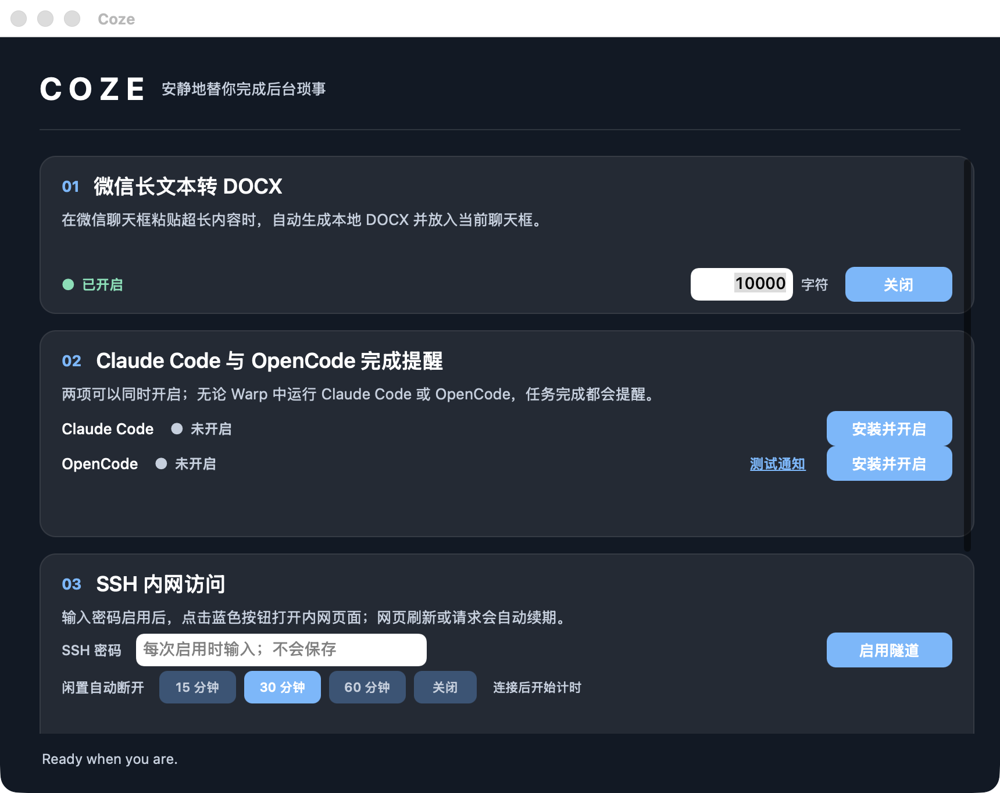
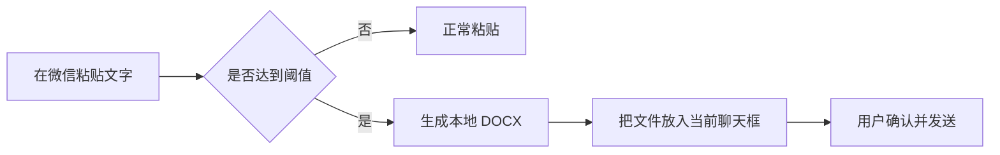
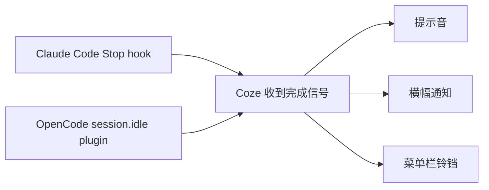
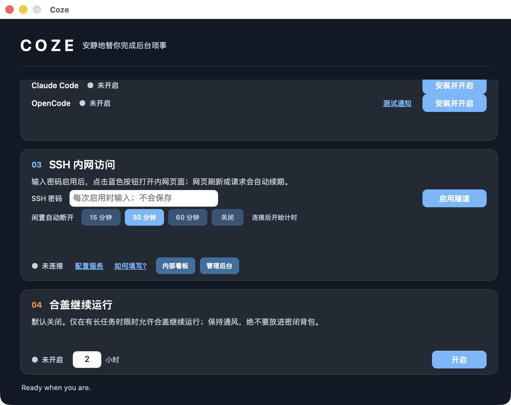

# Coze

Coze 是一个 macOS 后台小工具，用来处理微信超长文本、接收 Claude Code / OpenCode 完成提醒、通过 SSH 隧道访问内网页面，并支持限时合盖继续运行。



当前版本：**2.2**。macOS 安装包请从 [Releases](https://github.com/52css/Coze/releases/latest) 下载。

## 功能一：微信超长文本自动转 DOCX

默认阈值是 **10,000 字符**，可以在主界面修改。

1. 在 Coze 中开启“微信长文本转 DOCX”。
2. 在微信聊天输入框粘贴文字。
3. 少于阈值时正常粘贴；达到或超过阈值时，Coze 自动生成本地 DOCX。
4. DOCX 会被放入当前微信聊天框，确认后点击发送即可。



生成的文件默认保存在 `文稿/Coze Messages`。首次使用时，macOS 会要求授予“辅助功能”权限；Coze 需要该权限识别微信中的粘贴动作，但不会读取聊天记录，也不会自动发送消息。

## 功能二：Claude Code / OpenCode 完成提醒

Claude Code 与 OpenCode 可以同时开启。在 Warp、Terminal 或其他终端中运行任务后，任务完成时 Coze 会：

- 播放提示音；
- 显示 macOS 横幅通知；
- 临时把菜单栏图标变成铃铛；
- 在主窗口底部显示完成来源。



使用步骤：

1. 分别点击 Claude Code 和 OpenCode 的“安装并开启”。
2. 在终端中新开一次 Claude Code / OpenCode 会话，使 hook 或 plugin 生效。
3. 点击“测试通知”检查声音、横幅和通知权限。
4. 主窗口可以隐藏，但请让 Coze 保留在菜单栏中运行。

## 功能三：SSH 内网访问

Coze 从 `~/.coze/tunnel.json` 读取堡垒机和服务列表，服务数量不写死。配置完成后，每次只需输入 SSH 密码并启用一次隧道，即可通过蓝色按钮连续打开多个内网页面。



主要行为：

- 所有转发端口只绑定 `127.0.0.1`，同一局域网的其他设备不能直接访问。
- Coze 重新打开时会识别并接管与当前配置完全匹配的已有 SSH 隧道。
- 点击不同服务会复用同一条隧道，不重复要求 SSH 密码。
- SSH 密码仅通过匿名管道交给当次 SSH 认证，不进入环境变量，也不会写入配置文件或临时文件。
- 默认闲置 **30 分钟**自动断开，可选择 `15 / 30 / 60 分钟 / 关闭`。
- 网页刷新、页面跳转、接口请求、点击任一服务或“续期”，都会重新开始倒计时；SSH 保活包不算用户活动。

只有通过隧道产生的真实网络流量才会续期；单纯保持页面打开、移动鼠标或键盘输入不会续期。如果网页本身持续后台轮询，因为隧道仍在传输业务数据，倒计时也会持续刷新。

### 通用配置示例

首次点击“配置服务”，填写堡垒机主机、SSH 用户名和服务目标。配置文件结构如下：

```json
{
  "host": "bastion.example.com",
  "port": 22,
  "username": "your-user",
  "identityFile": "",
  "routes": [
    {
      "name": "内部看板",
      "localPort": 8080,
      "targetHost": "10.0.0.8",
      "targetPort": 80,
      "path": "/"
    }
  ]
}
```

仓库和安装包不包含任何个人服务器地址、用户名或 SSH 密码。

## 功能四：限时合盖继续运行

可设置 1–8 小时。开启后，Coze 会临时调整 macOS 休眠设置，到时间后尝试自动恢复。

此功能会消耗电量并产生热量。请把 Mac 放在通风、坚硬的平面上，绝不要放进背包或密闭空间。

## macOS 安装

1. 从 [Coze 2.2 Release](https://github.com/52css/Coze/releases/tag/v2.2) 下载 `Coze-2.2-macOS.zip`。
2. 解压后将 `Coze.app` 拖入“应用程序”。
3. 首次打开时，如果 macOS 阻止运行，请在 Finder 中按住 Control 点击应用并选择“打开”。
4. 根据使用的功能授予辅助功能和通知权限。

最低系统版本：macOS 12。

## 源码与构建

macOS 源码位于 [`macos/`](macos)，使用系统自带的 Swift 编译器构建：

```sh
swiftc -parse-as-library \
  -framework Cocoa \
  -framework ApplicationServices \
  -framework UserNotifications \
  macos/Coze.swift \
  -o Coze
```

发布包使用 [`scripts/build-macos-release.sh`](scripts/build-macos-release.sh) 构建。脚本会分别以 macOS 12 为目标编译 Apple 芯片与 Intel 版本，再合并为 Universal 应用。

自动化测试位于 [`tests/`](tests)。GitHub Release 也提供独立源码压缩包。

## Windows

Windows 10/11 版本目前提供“微信长文本转 DOCX”功能，不包含 macOS 的 SSH 隧道、Claude Code / OpenCode 通知和合盖运行功能。

源码位于 [`windows/`](windows)，也可以从 [v2.2 Release](https://github.com/52css/Coze/releases/tag/v2.2) 下载 `Coze-Windows-WeChatDocx.zip`。

## 2.2 更新内容

- 增加通用、动态的 SSH 内网访问配置。
- 为任意配置服务动态生成蓝色直达按钮，名称按配置原样显示。
- 修复 Coze 重开后无法识别已有 SSH 隧道的问题。
- 增加 15/30/60 分钟及关闭四档闲置自动断开。
- 根据真实网页流量自动刷新倒计时；页面刷新、跳转和接口请求都会续期，SSH 保活包不会让隧道永久在线。
- 更新 README 为 2.2 实际界面与完整使用说明。
