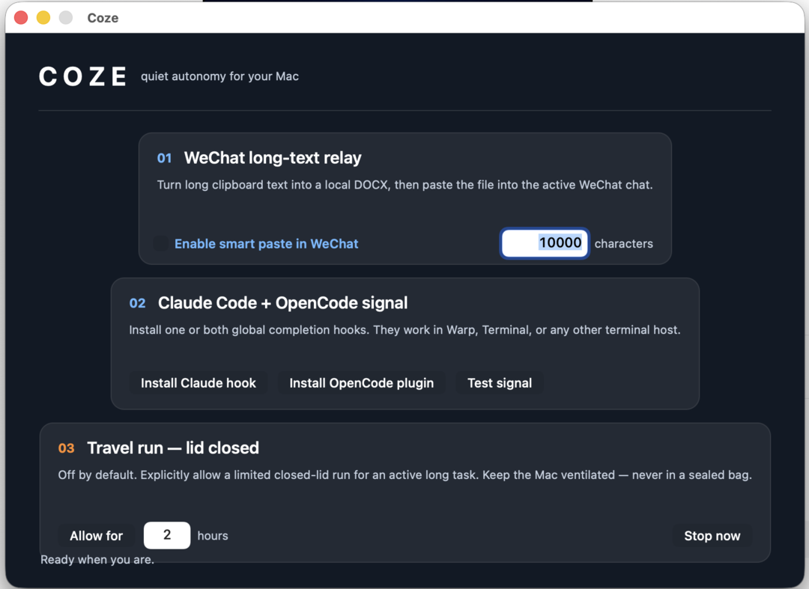
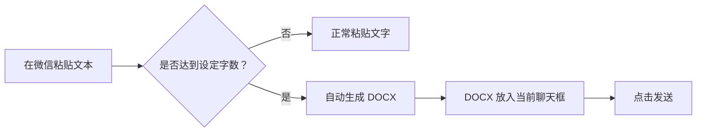
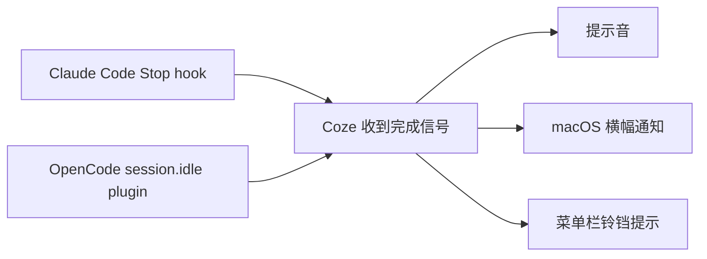

# Coze

一个 macOS 小工具：把微信里的超长文字快速变成 DOCX，并在 Claude Code 或 OpenCode 完成任务时提醒你。



## 功能一：微信超长文本自动转 DOCX

适用于需要在微信里发送很长的内容、但又不想让聊天窗口被整段文字占满的场景。

1. 打开 Coze，在“微信长文本转 DOCX”中点击“开启”；默认阈值为 **10,000 字符**，可自行修改。
2. 在微信聊天输入框粘贴文字：少于阈值时和往常一样粘贴；达到或超过阈值时，Coze 自动把文本生成一个本地 DOCX 文件。
3. Coze 会把 DOCX 文件放入当前微信聊天输入框；确认文件名后，直接点击发送即可。



首次开启此功能时，macOS 会要求授予“辅助功能”权限；这是为了让 Coze 能识别微信中的粘贴动作并替换为文件。生成的 DOCX 默认保存在“文稿 / Coze Messages”中，也可以在发送前自行打开检查。

## 功能二：Claude Code / OpenCode 完成提醒

当你在 Warp（或其他终端）中同时跑 Claude Code 和 OpenCode 时，可在 Coze 中把两项都开启。任务完成后，Coze 会播放提示音、显示 macOS 通知，并把菜单栏图标暂时变成铃铛。



使用步骤：

1. 在 Coze 的“Claude Code 与 OpenCode 完成提醒”区域，分别点击 Claude Code 和 OpenCode 的“安装并开启”。两项互不冲突，可以同时开启。
2. 在 Warp 中重新新开一次 Claude Code / OpenCode 会话，使新安装的 hook 或 plugin 被加载。
3. Coze 的主窗口可以关闭或隐藏，但请让它继续在菜单栏运行；任务结束后即可收到提醒。

可点击“测试通知”确认 macOS 通知权限、声音及横幅是否正常。若没有横幅，请检查系统“通知”设置和勿扰模式。

## 功能三：限时合盖继续运行

只适合短期长任务：设置 1–8 小时后开启，Coze 会临时调整系统休眠设置，到时间后自动恢复。请保持设备通风，绝不要把运行中的 Mac 放入背包或密闭空间。

## macOS 安装

从 [`releases/Coze-1.5-macOS.zip`](releases/Coze-1.5-macOS.zip) 解压，将 `Coze.app` 拖入“应用程序”文件夹后打开。

首次使用时，如 macOS 阻止打开，请在 Finder 中按住 Control 点击应用并选择“打开”。

## 源码

macOS 源码位于 [`macos/`](macos)：使用 macOS 自带的 Swift 编译器构建。

```sh
swiftc -parse-as-library -framework Cocoa -framework ApplicationServices -framework UserNotifications macos/Coze.swift -o Coze
```

## Windows

Windows 的微信长文本转 DOCX 脚本位于 [`windows/`](windows)。请查看该目录中的 README 了解使用步骤。

## 版本

当前发布版本：1.5。
